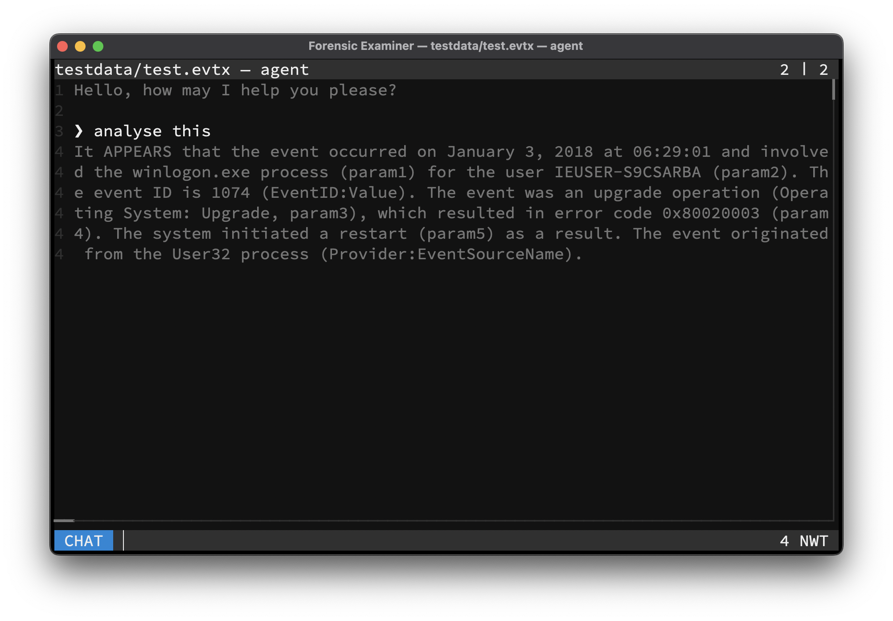

# Agent

An AI agent can be activated, to analyse line-based files. A running [Ollama](https://ollama.com) instance, locally or remote, is required for this functionality.

> The agent can also be executed per `--query` flag.

## LLM
The used model and its parameters can be configured per user config or given per command line flags. For a list of supported models, please consult the [Ollama Model Library](https://ollama.com/search). It is advised to use at least a 7B model like `mistral` or `deepseek-r1`.

## RAG
All currently open files will be split by lines and all lines will be embedded into an in-memory only **Vector Database** as a document collection. A relevant subset of these documents will be retried by the LLM for generating the users chat response. It is advised to use a specialized embedding model like `nomic-embed-text`.

## Commands
The used models can be switched on-the-fly:

| Command           | Description                    |
|-------------------|--------------------------------|
| `list`            | List locally available models  |
| `use model MODEL` | Pull and set LLM chat `MODEL`  |
| `use embed MODEL` | Pull and set embedding `MODEL` |
| `del MODEL`       | Delete local `MODEL`           |

## Example

