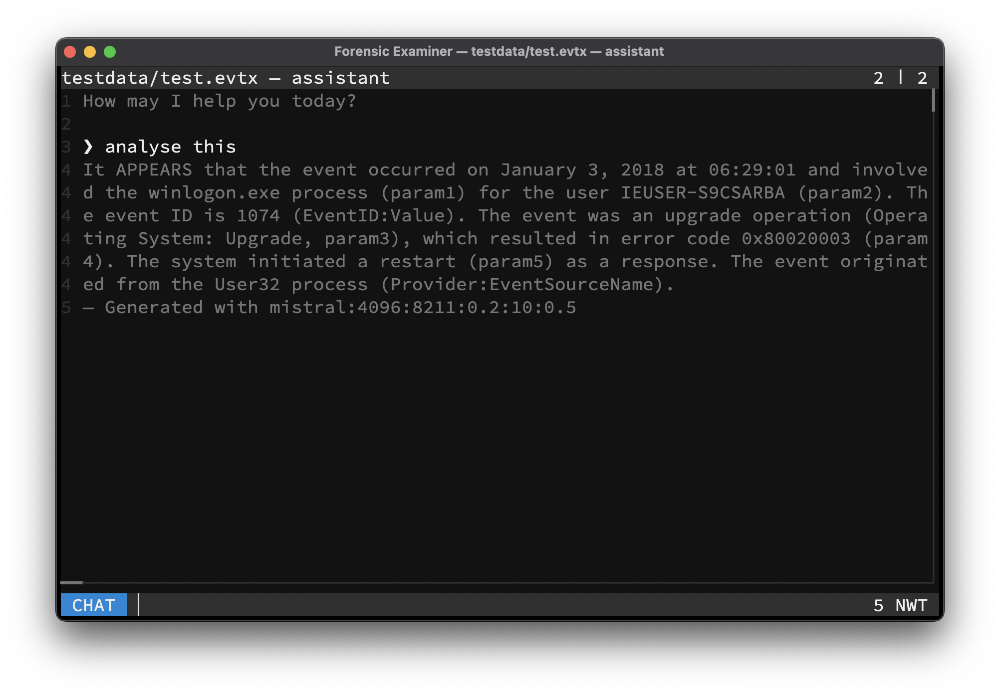

# AI Assistant

An AI assistant can be activated, to analyse line-based text files. The assistant operates on a per-file basis, with an isolation between the analysed files per design. A running [Ollama](https://ollama.com) server, locally or remote, is required for this functionality. To extend its capabilities, the server can also make use of the **Model Context Protocol**. Please consult the Ollama documentation for details.



## Large Language Model
The used analysing model and its parameters can be set in the configuration file or given per command line flags. For a list of supported models, please consult the [Ollama Model Library](https://ollama.com/search). It is advised to use at least a 7B model like `mistral` or `deepseek-r1` for meaningful results.

> The assistant can also be executed per `--query` flag from the console.

## Retrieval-Augmented Generation
The currently filtered lines will be embedded into an in-memory only **Vector Database** as a document collection. A relevant subset of these lines will be retried by the LLM for generating the response. It is advised to use a specialized embedding model like `nomic-embed-text` for this.

> Embedding large chunks of text can take a certain amount of time.

## Example
```console
$ fox testdata/test.evtx -pe="winlogon" -q="analyse this" 
It APPEARS that the event occurred on January 3, 2018 at 06:29:01 and involved the winlogon.exe process (param1) for the user IEUSER-S9CSARBA (param2).
The event ID is 1074 (EventID:Value). The event was an upgrade operation (Operating System: Upgrade, param3), which resulted in error code 0x80020003 (param4).
The system initiated a restart (param5) as a response. The event originated from the User32 process (Provider:EventSourceName).
— Generated with mistral:4096:8211:0.2:10:0.5
```
