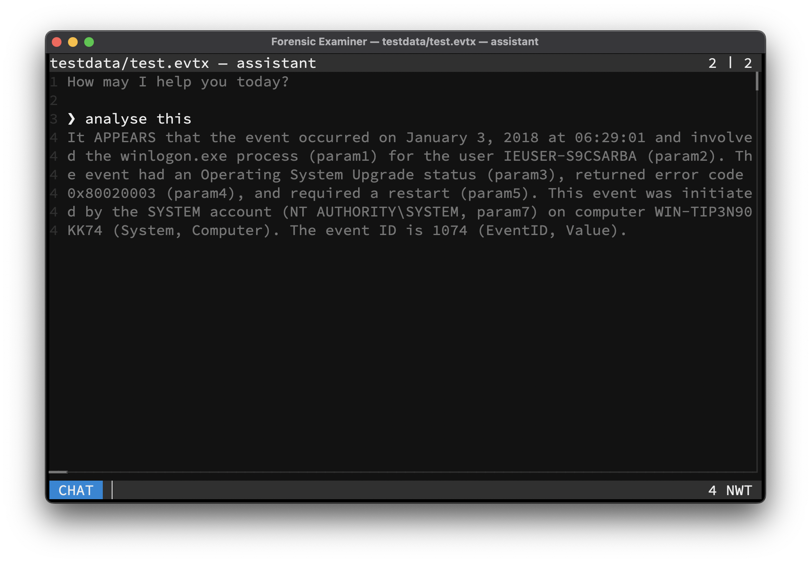

# Assistant

An AI assistant can be activated, to analyse line-based files. A running [Ollama](https://ollama.com) instance, locally or remote, is required for this functionality.

> The assistant can also be executed per `--query` flag.

## Large Language Model
The used model and its parameters can be configured per user config or given per command line flags. For a list of supported models, please consult the [Ollama Model Library](https://ollama.com/search). It is advised to use at least a 7B model like `mistral` or `deepseek-r1`.

## Retrieval-Augmented Generation
The currently filtered lines will be embedded into an in-memory only **Vector Database** as a document collection. A relevant subset of these lines will be retried by the LLM for generating the response. It is advised to use a specialized embedding model like `nomic-embed-text`.

> Embedding large chunks of text can take a certain amount of time.

## Commands
The used models can be switched on-the-fly:

| Command          | Description                            |
|------------------|----------------------------------------|
| `stop`           | Stops the current activity             |
| `list`           | Lists locally available models         |
| `set model NAME` | Pulls and sets the LLM analysing model |
| `set embed NAME` | Pulls and sets the RAG embedding model |
| `get model`      | Shows the current LLM analysing model  |
| `get embed`      | Shows the current RAG embedding model  |
| `del NAME`       | Deletes the local model                |

## Example

