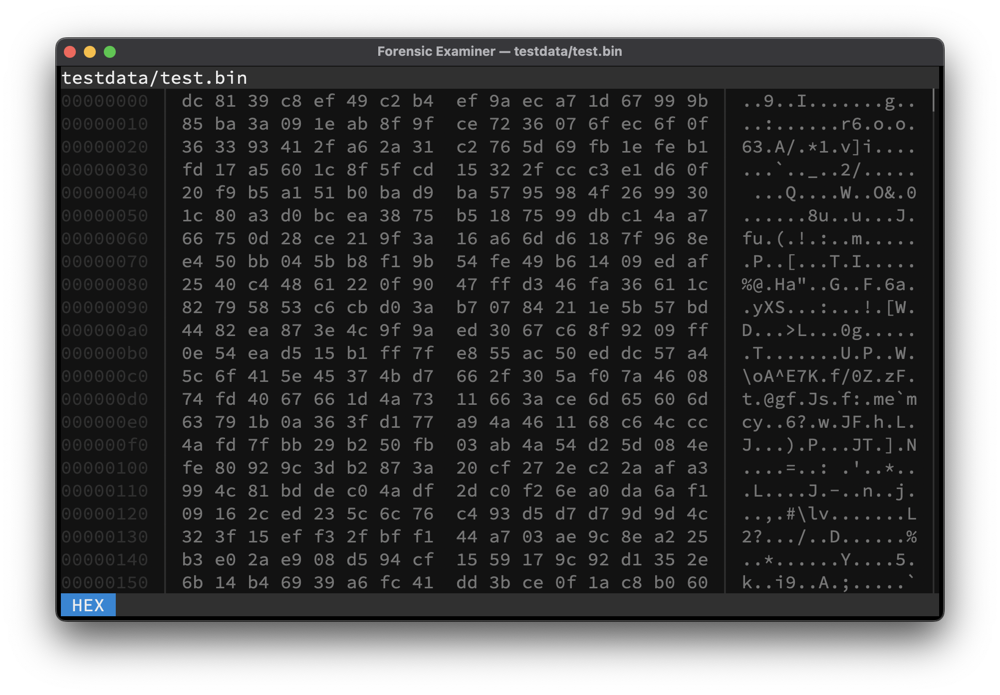

# Hex mode
All files can be viewed in the canonical `hexdump` format by switching to Hex mode. Here, the first column specifies the file offset, the second column the hex values and the third column displays the decoded ASCII text.

!!! tip "Tip"

    Use <kbd>Ctrl</kbd> + <kbd>X</kbd> to switch to Hex mode while in the Terminal UI.

## Keymap
Available mode specific keys:

| Key              | Action               |
|------------------|----------------------|
| <kbd>Enter</kbd> | Scroll one line down |
| <kbd>Space</kbd> | Scroll one page down |

## Example

