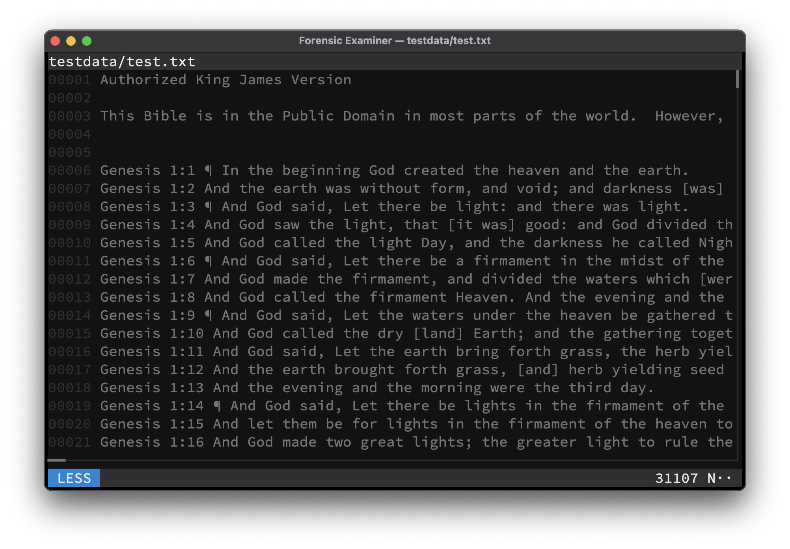

# Less mode
All files can be viewed like with the `less` terminal pager by switching to Less mode.

!!! tip "Tip"

    Use <kbd>Ctrl</kbd> + <kbd>L</kbd> to switch to Less mode while in the Terminal UI.

## Keymap
Available mode specific keys:

| Key              | Action                         |
|------------------|--------------------------------|
| <kbd>Enter</kbd> | Scroll one line down           |
| <kbd>Space</kbd> | Scroll one page down           |
| *Any other key*  | Switch to [Grep](grep.md) mode |

## Example

