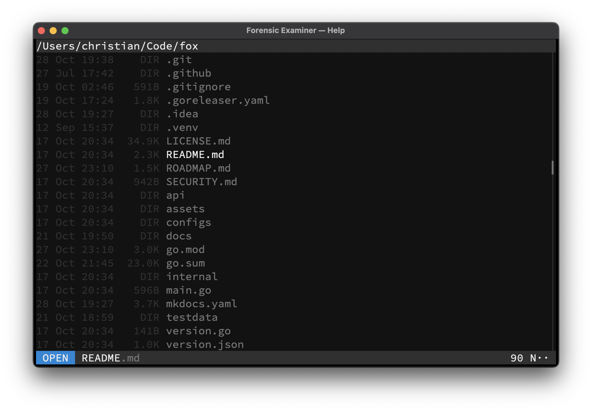

# Open mode
Additional files and paths can be opened via the [Loader](../../files/loader.md) component by switching to Open mode.

!!! tip "Tip"

    Use <kbd>Ctrl</kbd> + <kbd>O</kbd> to switch to Open mode while in the Terminal UI.

## Keymap
Available mode specific keys:

| Key                                | Action                         |
|------------------------------------|--------------------------------|
| <kbd>Esc</kbd>                     | Switch to [Less](less.md) mode |
| <kbd>Enter</kbd>                   | Open file(s)                   |
| <kbd>Up</kbd>                      | Prev file in directory         |
| <kbd>Down</kbd>                    | Next file in directory         |
| <kbd>Left</kbd>                    | Move cursor left               |
| <kbd>Right</kbd>                   | Move cursor right              |
| <kbd>Right</kbd> at the end        | Complete suggestion            |
| <kbd>Ctrl</kbd> + <kbd>Left</kbd>  | Move cursor to start           |
| <kbd>Ctrl</kbd> + <kbd>Right</kbd> | Move cursor to end             |
| <kbd>Ctrl</kbd> + <kbd>V</kbd>     | Paste from clipboard           |
| *Any other key*                    | Define file path(s)            |

## Example

