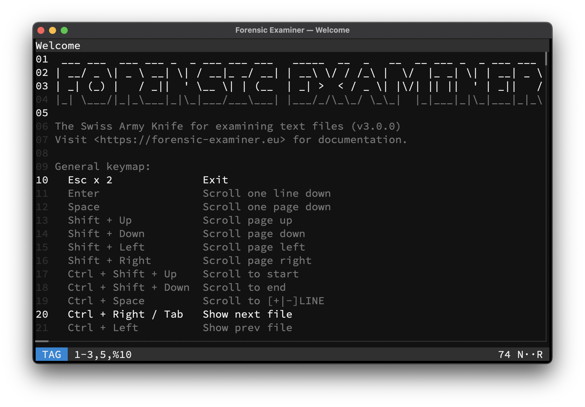

# Tag mode
Individual lines can be tagged for [Evidence](../../features/evidence.md) saving by switching to Tag mode.

!!! tip "Tip"

    Use <kbd>Ctrl</kbd> + <kbd>T</kbd> to switch to Tag mode while in the Terminal UI.

## Lines and ranges
Specific lines and line range can be picked using the syntax defined below.

| Syntax        | Meaning              |
|---------------|----------------------|
| `1`           | Tag line `1`         |
| `1,2`         | Tag lines `1` & `2`  |
| `1-3`         | Tag lines `1` to `3` |
| `%4`          | Tag every `4`th line |
| `a`, `all`    | Tag all lines        |
| `n`, `none`   | Untag all lines      |
| `i`, `invert` | Invert all lines     |

## Keymap
Available tag specific keys:

| Key                            | Action          |
|--------------------------------|-----------------|
| <kbd>Ctrl</kbd> + <kbd>A</kbd> | Tag all lines   |
| <kbd>Ctrl</kbd> + <kbd>U</kbd> | Untag all lines |

Available mode specific keys:

| Key                                | Action                         |
|------------------------------------|--------------------------------|
| <kbd>Esc</kbd>                     | Switch to [Less](less.md) mode |
| <kbd>Enter</kbd>                   | Tag line(s)                    |
| <kbd>Up</kbd>                      | Prev value in history          |
| <kbd>Down</kbd>                    | Next value in history          |
| <kbd>Left</kbd>                    | Move cursor left               |
| <kbd>Right</kbd>                   | Move cursor right              |
| <kbd>Right</kbd> at the end        | Complete suggestion            |
| <kbd>Ctrl</kbd> + <kbd>Left</kbd>  | Move cursor to start           |
| <kbd>Ctrl</kbd> + <kbd>Right</kbd> | Move cursor to end             |
| <kbd>Ctrl</kbd> + <kbd>V</kbd>     | Paste from clipboard           |
| *Any other key*                    | Define line(s)                 |

## Example

