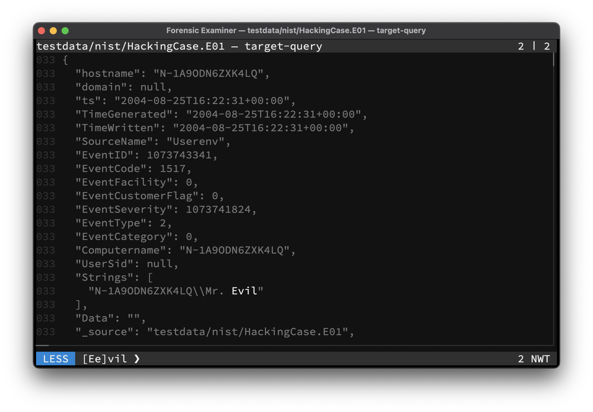

The Swiss Army Knife for examining text files. Combining the power of many traditional tools like **grep**, **diff**, **hexdump** and **strings** with the abilities of modern Large Language Models, to leverage your forensic examination process. Available for **Windows**, **Linux** and **macOS**.

[Start examining](start/install.md){ .md-button .md-button--primary }
