# Build-in themes
Build-in and custom themes can be cycled in this order via the <kbd>Ctrl</kbd> + <kbd>^</kbd> hotkey.

## Examiner Dark
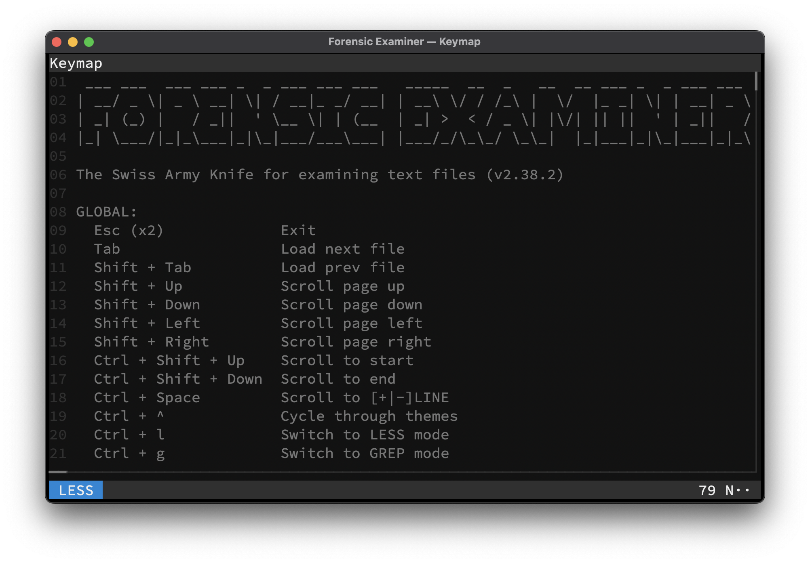

## Examiner Light
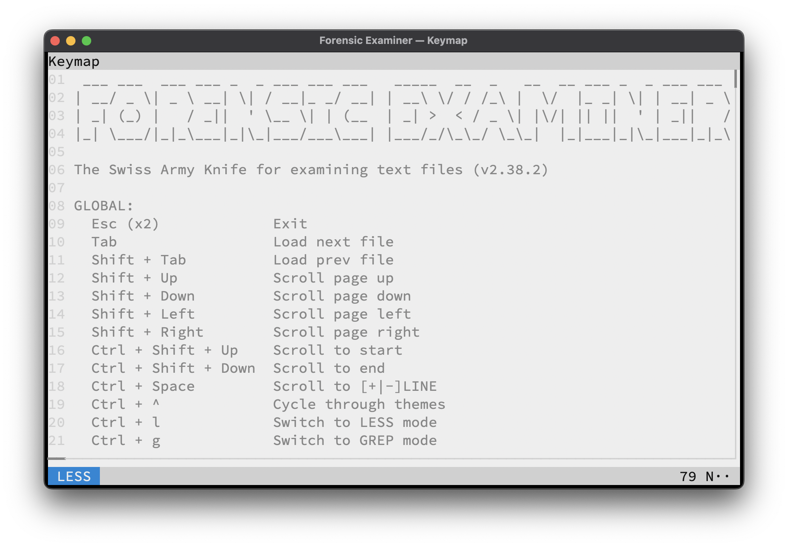

## Catppuccin Latte
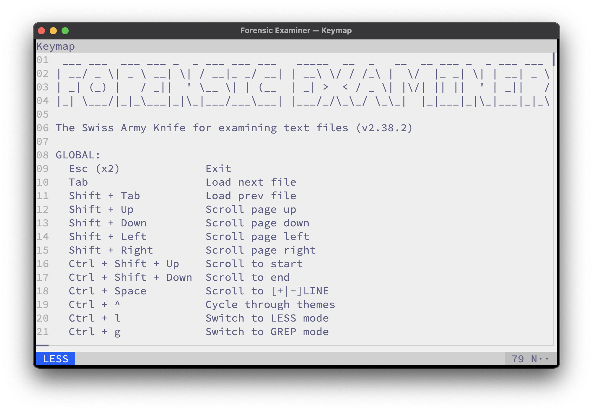

## Catppuccin Frappe
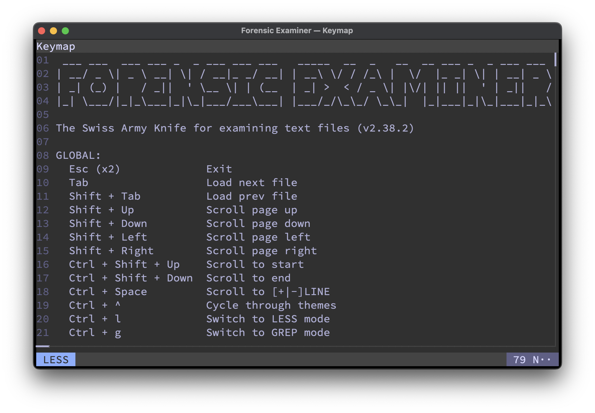

## Catppuccin Macchiato
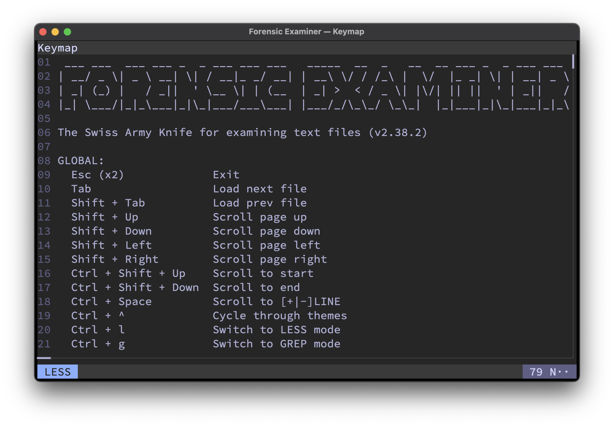

## Catppuccin Mocha
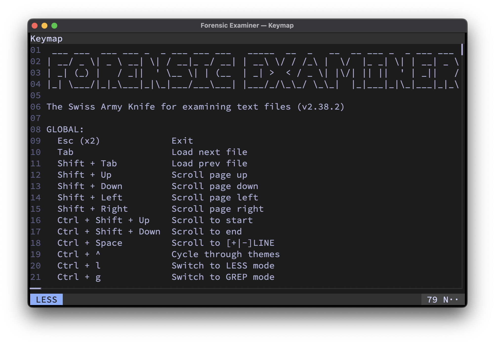

## Solarized Dark
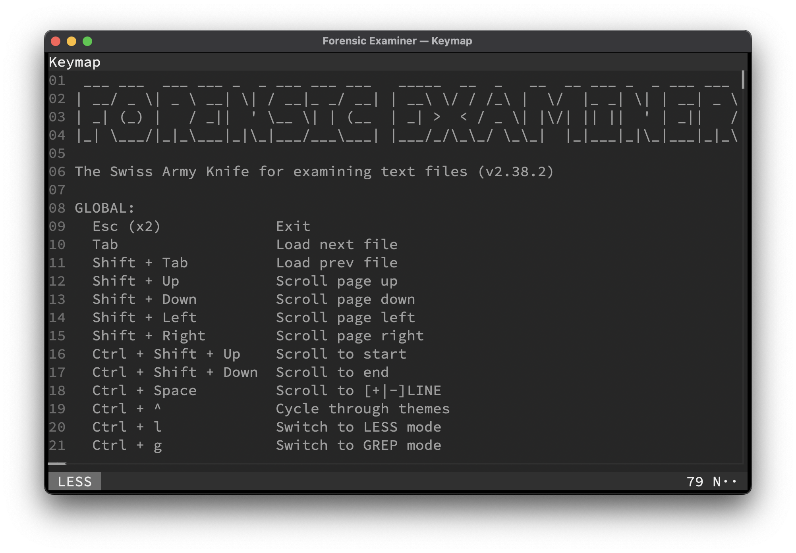

## Solarized Light
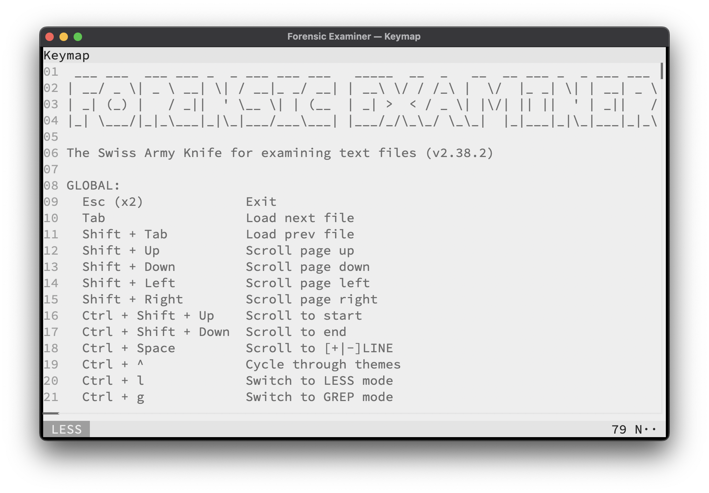

## VSCode Dark

## VSCode Light

## Monokai
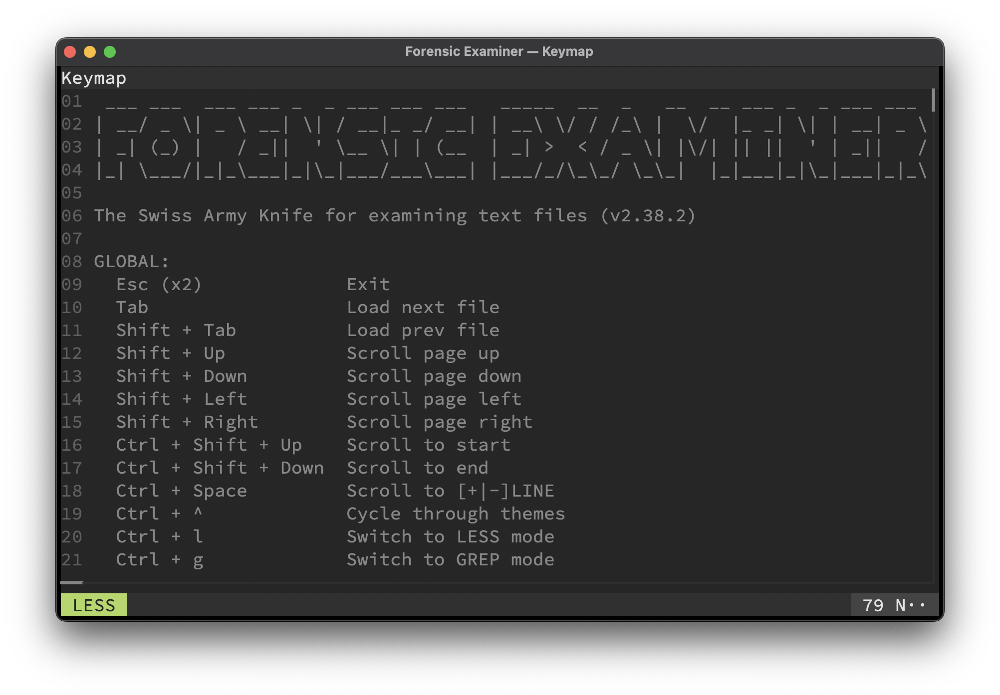

## Darcula
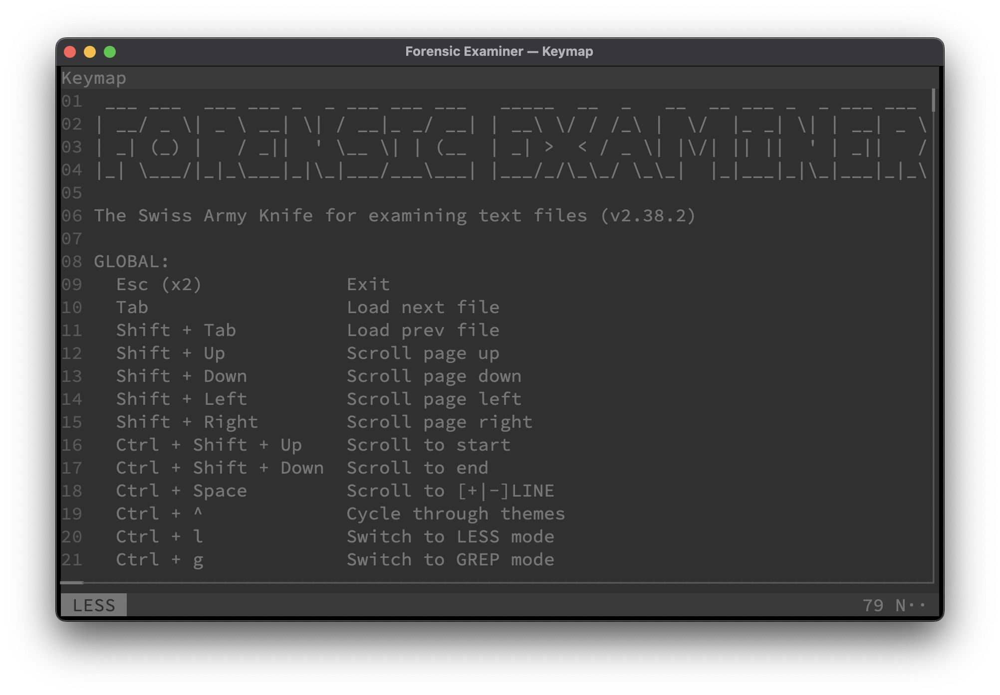

## Nord
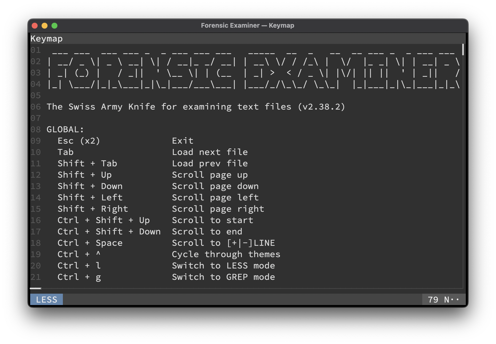

## Matrix
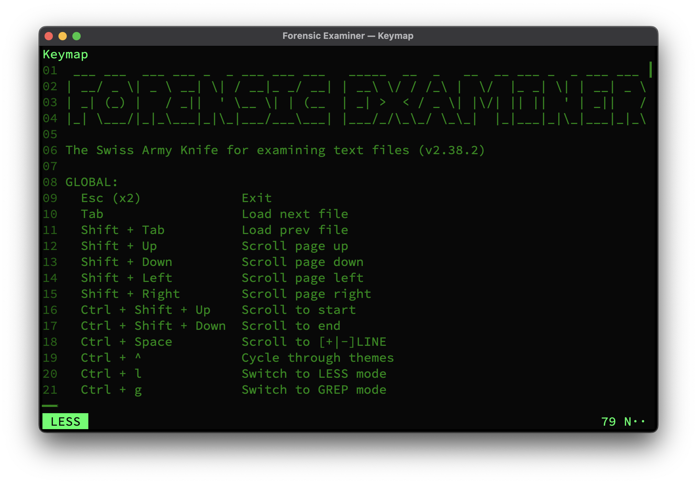

## Monochrome
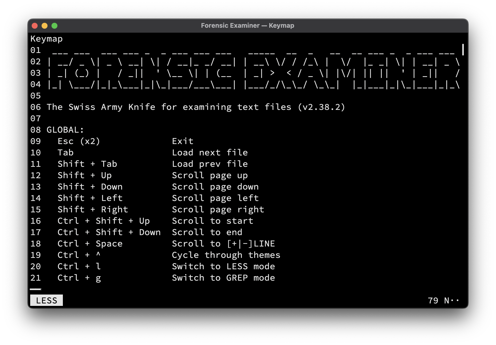
